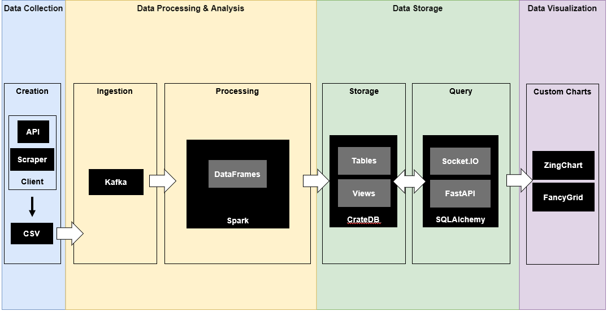

# Concept

SoDa-TAP was designed based on two main concepts: microservices and cloud. From the microservices perspective, it supports further connectivity and compatibility with other software that has the capability to communicate with external services through a network connection. This capability is possible thanks to the containerization of its services through [Docker]. And from the cloud side, it is capable to be deployed locally or in the cloud through virtualization, which is possible thanks to [Vagrant], to create virtual instances with custom resources and [Ansible], to automate repetitive configurations through code.

  [Docker]: https://www.docker.com/
  [Vagrant]: https://www.vagrantup.com/
  [Ansible]: https://www.ansible.com/

## Components

SoDa-TAP was built to be able to work in two ways with data, streaming or offline. This characteristic is possible thanks to the connectivity of the available software/libraries from the open source community:

- **[Spark Structured Streaming]:** Parallelization/distribution of tasks within all the cores to take advantage of the computing resources and speed up code execution (local or cluster based).
- **[Kafka]:** Distributed communication buffer to process high loads of data and connect end to end a source with a sink for data transfer/communication.
- **[CrateDB]:** Distributed storage to hold all the necessary records within tables or views.
- **Visualizations:** Custom developed visualizations made with [ZingChart] and [FancyGrid].

These services are what conform the data stages that SoDa-TAP follows. **Data collection** through a custom developed client that creates a CSV file, to pass it over for **data processing & analysis** with custom defined functions for specific uses cases, that later is transferred to the **data storage** to store the raw and augmented records, and to finalize, to see or reveal insights about the data, the records are consulted by the **data visualization** set of custom defined graphs.

  [Spark Structured Streaming]: https://spark.apache.org/docs/latest/structured-streaming-programming-guide.html
  [Kafka]: https://kafka.apache.org/
  [CrateDB]: https://crate.io/
  [ZingChart]: https://www.zingchart.com/
  [FancyGrid]: https://fancygrid.com/

<figure markdown>
  
  <figcaption>SoDa-TAP Components</figcaption>
</figure>