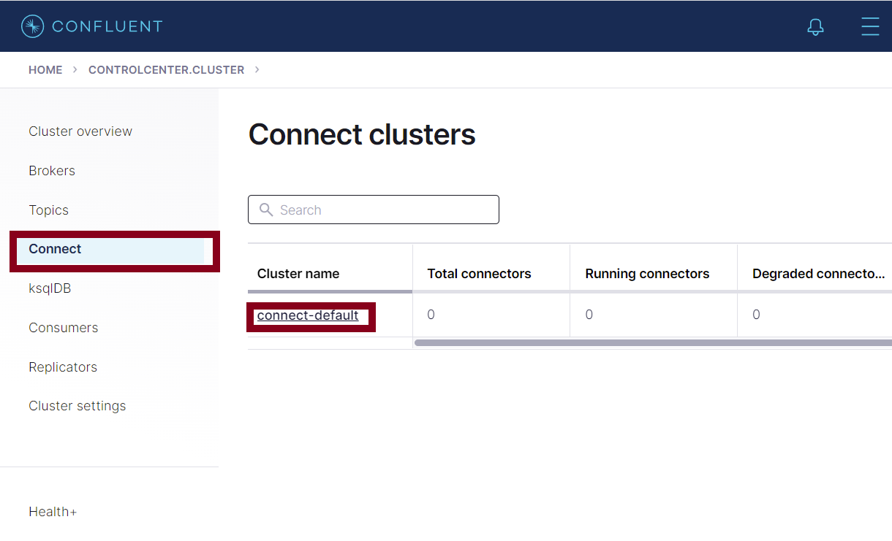

# Deployment

There are 2 ways that you can deploy the data platform, one, by using your own environment already configured with Docker and start all the required services with your own needs or two, by creting a new virtual environment from scratch to have more control over what resources to use and how many. The main difference is that the later was targeted to not so experienced users with coding by also accompanying it with a custom defined dictionary to control machine and dataset variables. 

In both cases, the custom developed services that will be launched as part of the data platform are:

- [JupyterLab] (Data retrieval client and SoDa-TAP engine).
- [APIs].
- [Visualizations] (If needed).

  [JupyterLab]: https://github.com/cande1gut/SoDa-TAP
  [APIs]: https://github.com/cande1gut/apis
  [Visualizations]: https://github.com/cande1gut/cecn-visualizations

## Own Environment 

For this scenario you only require to reuse the previously mentioned resources over your own environment:

### To deploy CrateDB, Kafka, and JupyterLab

  ``` yaml
  version: '3.3'
  services:
    #CrateDB
    cratedb:
      image: crate:4.7.1 # (1)!
      container_name: cratedb
      ports:
        - 4200:4200
        - 4300:4300
        - 5432:5432
      volumes: # (2)!
        - ./crateData:/data
      command: ["crate",
                "-Ccluster.name=CECN",
                "-Cnode.name=cratedb",
                "-Cnode.data=true",
                "-Cnetwork.host=_site_",
                "-Cdiscovery.seed_hosts=cratedb_02,cratedb_03",
                "-Ccluster.initial_master_nodes=cratedb,cratedb_02,cratedb_03",
                "-Cgateway.expected_nodes=3",
                "-Cgateway.recover_after_nodes=2",
                "-Chttp.cors.enabled=true",
                "-Chttp.cors.allow-origin=*"
                ]
      deploy:
        replicas: 1
        restart_policy:
          condition: on-failure
      environment:
        - CRATE_HEAP_SIZE=2g # (3)!

    cratedb_02:
      image: crate:4.7.1 # (4)!
      container_name: cratedb_02
      ports:
        - 4201:4200
      volumes: # (5)!
        - ./crateData2:/data
      command: ["crate",
                "-Ccluster.name=CECN",
                "-Cnode.name=cratedb_02",
                "-Cnode.data=true",
                "-Cnetwork.host=_site_",
                "-Cdiscovery.seed_hosts=cratedb,cratedb_03",
                "-Ccluster.initial_master_nodes=cratedb,cratedb_02,cratedb_03",
                "-Cgateway.expected_nodes=3",
                "-Cgateway.recover_after_nodes=2"]
      deploy:
        replicas: 1
        restart_policy:
          condition: on-failure
      environment:
        - CRATE_HEAP_SIZE=2g # (6)!

    cratedb_03:
      image: crate:4.7.1 # (7)!
      container_name: cratedb_03
      ports:
        - 4202:4200
      volumes: # (8)!
        - ./crateData3:/data
      command: ["crate",
                "-Ccluster.name=CECN",
                "-Cnode.name=cratedb_03",
                "-Cnode.data=true",
                "-Cnetwork.host=_site_",
                "-Cdiscovery.seed_hosts=cratedb,cratedb_02",
                "-Ccluster.initial_master_nodes=cratedb,cratedb_02,cratedb_03",
                "-Cgateway.expected_nodes=3",
                "-Cgateway.recover_after_nodes=2"]
      deploy:
        replicas: 1
        restart_policy:
          condition: on-failure
      environment:
        - CRATE_HEAP_SIZE=2g # (9)!

    #Kafka
    zookeeper:
      image: confluentinc/cp-zookeeper:7.0.0 # (10)!
      hostname: zookeeper
      container_name: zookeeper
      ports:
        - 2181:2181
      environment:
        ZOOKEEPER_CLIENT_PORT: 2181
        ZOOKEEPER_TICK_TIME: 2000

    broker:
      image: confluentinc/cp-enterprise-kafka:7.0.0 # (11)!
      hostname: broker
      container_name: broker
      depends_on:
        - zookeeper
      ports:
        - 29092:29092
        - 9092:9092
        - 31001:31001
      environment:
        KAFKA_BROKER_ID: 1
        KAFKA_ZOOKEEPER_CONNECT: 'zookeeper:2181'
        KAFKA_LISTENER_SECURITY_PROTOCOL_MAP: PLAINTEXT:PLAINTEXT,PLAINTEXT_HOST:PLAINTEXT
        KAFKA_ADVERTISED_LISTENERS: PLAINTEXT://broker:29092,PLAINTEXT_HOST://localhost:9092
        KAFKA_OFFSETS_TOPIC_REPLICATION_FACTOR: 1
        KAFKA_TRANSACTION_STATE_LOG_MIN_ISR: 1
        KAFKA_TRANSACTION_STATE_LOG_REPLICATION_FACTOR: 1
        #KAFKA_GROUP_INITIAL_REBALANCE_DELAY_MS: 0
        #KAFKA_JMX_PORT: 9101
        KAFKA_INTER_BROKER_LISTENER_NAME: PLAINTEXT
        KAFKA_DELETE_TOPIC_ENABLE: 'true'
        KAFKA_AUTO_CREATE_TOPICS_ENABLE: 'true'
        KAFKA_METRIC_REPORTERS: io.confluent.metrics.reporter.ConfluentMetricsReporter
        KAFKA_OFFSETS_TOPIC_REPLICATION_FACTOR: 1
        KAFKA_GROUP_INITIAL_REBALANCE_DELAY_MS: 100
        CONFLUENT_METRICS_REPORTER_BOOTSTRAP_SERVERS: broker:29092
        CONFLUENT_METRICS_REPORTER_ZOOKEEPER_CONNECT: zookeeper:2181
        CONFLUENT_METRICS_REPORTER_TOPIC_REPLICAS: 1
        CONFLUENT_METRICS_ENABLE: 'false'
        CONFLUENT_SUPPORT_CUSTOMER_ID: 'anonymous'
        KAFKA_JMX_HOSTNAME: "localhost"
        KAFKA_JMX_PORT: 31001

    schema-registry:
      image: confluentinc/cp-schema-registry:7.0.0 # (12)!
      hostname: schema-registry
      container_name: schema-registry
      depends_on:
        - broker
      ports:
        - 8081:8081
      environment:
        SCHEMA_REGISTRY_HOST_NAME: schema-registry
        SCHEMA_REGISTRY_KAFKASTORE_BOOTSTRAP_SERVERS: 'broker:29092'
        SCHEMA_REGISTRY_LISTENERS: http://0.0.0.0:8081

    connect:
      image: confluentinc/cp-kafka-connect:7.0.0 # (13)!
      hostname: connect
      container_name: connect
      depends_on:
        - broker
        - schema-registry
      volumes:
        - /home/vagrant/SoDa-TAP/data:/data
      ports:
        - 8083:8083
      environment:
        CONNECT_BOOTSTRAP_SERVERS: 'broker:29092'
        CONNECT_REST_ADVERTISED_HOST_NAME: connect
        CONNECT_REST_PORT: 8083
        CONNECT_GROUP_ID: compose-connect-group
        CONNECT_CONFIG_STORAGE_TOPIC: docker-connect-configs
        CONNECT_CONFIG_STORAGE_REPLICATION_FACTOR: 1
        CONNECT_OFFSET_FLUSH_INTERVAL_MS: 10000
        CONNECT_OFFSET_STORAGE_TOPIC: docker-connect-offsets
        CONNECT_OFFSET_STORAGE_REPLICATION_FACTOR: 1
        CONNECT_STATUS_STORAGE_TOPIC: docker-connect-status
        CONNECT_STATUS_STORAGE_REPLICATION_FACTOR: 1
        CONNECT_KEY_CONVERTER: org.apache.kafka.connect.storage.StringConverter
        CONNECT_VALUE_CONVERTER: io.confluent.connect.avro.AvroConverter
        CONNECT_VALUE_CONVERTER_SCHEMA_REGISTRY_URL: http://schema-registry:8081
        CONNECT_PLUGIN_PATH: "/usr/share/java,/usr/share/confluent-hub-components"
        CONNECT_LOG4J_LOGGERS: org.apache.zookeeper=ERROR,org.I0Itec.zkclient=ERROR,org.reflections=ERROR
      command:
        - bash
        - -c
        - |
          echo "Installing connector plugins"
          confluent-hub install --no-prompt confluentinc/kafka-connect-jdbc:5.4.1
          #confluent-hub install --no-prompt jcustenborder/kafka-connect-twitter:0.3.33
          confluent-hub install --no-prompt jcustenborder/kafka-connect-spooldir:2.0.62
          #confluent-hub install --no-prompt streamthoughts/kafka-connect-file-pulse:2.4.0
          #
          echo "Downloading JDBC driver"
          cp /data/crate-jdbc-2.6.0.jar /usr/share/confluent-hub-components/confluentinc-kafka-connect-jdbc
          cd /usr/share/confluent-hub-components/confluentinc-kafka-connect-jdbc
          #curl https://cdn.mysql.com/Downloads/Connector-J/mysql-connector-java-8.0.19.tar.gz | tar xz
          wget https://jdbc.postgresql.org/download/postgresql-42.2.14.jar
          #wget https://repo1.maven.org/maven2/io/crate/crate-jdbc/2.6.0/crate-jdbc-2.6.0.jar -o crate-jdbc-2.6.0.jar
          #curl -o crate-jdbc-2.6.0.jar https://repo1.maven.org/maven2/io/crate/crate-jdbc/2.6.0/crate-jdbc-2.6.0.jar
          #
          echo "Launching Kafka Connect worker"
          /etc/confluent/docker/run &
          #
          sleep infinity

    control-center:
      image: confluentinc/cp-enterprise-control-center:7.0.0 # (14)!
      hostname: control-center
      container_name: control-center
      depends_on:
        - broker
        - schema-registry
        - connect
      ports:
        - 9021:9021
      environment:
        CONTROL_CENTER_BOOTSTRAP_SERVERS: 'broker:29092'
        CONTROL_CENTER_ZOOKEEPER_CONNECT: 'zookeeper:2181'
        CONTROL_CENTER_CONNECT_CONNECT-DEFAULT_CLUSTER: 'connect:8083'
        CONTROL_CENTER_SCHEMA_REGISTRY_URL: "http://schema-registry:8081"
        CONFLUENT_METRICS_TOPIC_REPLICATION: 1
        CONTROL_CENTER_REPLICATION_FACTOR: 1
        CONTROL_CENTER_COMMAND_TOPIC_REPLICATION: 1
        CONTROL_CENTER_MONITORING_INTERCEPTOR_TOPIC_REPLICATION: 1
        CONTROL_CENTER_INTERNAL_TOPICS_PARTITIONS: 1
        CONTROL_CENTER_INTERNAL_TOPICS_REPLICATION: 1
        CONTROL_CENTER_MONITORING_INTERCEPTOR_TOPIC_PARTITIONS: 1
        CONTROL_CENTER_STREAMS_NUM_STREAM_THREADS: 1
        CONTROL_CENTER_STREAMS_CACHE_MAX_BYTES_BUFFERING: 104857600
        PORT: 9021

    #Jupyterlab
    jupyterlab:
      image: cande/jupyterlab:latest # (15)!
      container_name: jupyterlab
      volumes:
        - ./notebooks:/notebooks
      ports:
        - 10000:8888
        - 4040:4040
      environment:
        - JUPYTER_ENABLE_LAB=1
        #- GRANT_SUDO=yes
      command: start-notebook.sh --NotebookApp.notebook_dir=/notebooks

    networks: # (16)!
      default:
        external:
          name: cratenet
  ```

  1.  Same CrateDB version. 

  2.  CrateDB directory to store data in the machine.
    
  3.  Enviornment variable to control the Java heap for data retrieval.

  4.  Same CrateDB version. 

  5.  CrateDB directory to store data in the machine.

  6.  Enviornment variable to control the Java heap for data retrieval.

  7.  Same CrateDB version. 

  8.  CrateDB directory to store data in the machine.

  9.  Enviornment variable to control the Java heap for data retrieval.

  10. Same Confluent version. 

  11. Same Confluent version. 

  12. Same Confluent version. 

  13. Same Confluent version. 

  14. Same Confluent version. 

  15. You can keep updating the image with your own libraries and create one of your own to use instead of this one.

  16. All the services need to be in the same network previosly created to be able to communicate.

### To deploy APIs and Custom Visualizations

Using the github repo: Locate yourself in the root directory of each of the repo ([APIs] and [Visualizations]) where a 'docker-compose.yaml' file is present and run the below instruction under the command prompt.

  ``` bash
  docker-compose up -d
  ```

  [APIs]: https://github.com/cande1gut/apis
  [Visualizations]: https://github.com/cande1gut/cecn-visualizations

## Create Environment

SoDa-TAP requires for [Vagrant] and [Virtualbox] to be installed beforehand, since they act as provisioners for a virtual environment with all tools, packages and libaries available to work properly.

  [Vagrant]: https://www.vagrantup.com/
  [Virtualbox]: https://www.virtualbox.org/

### Configuring Environment Resources

First define how much RAM and how many CPUs you want to assign to your environment in the "Vagrant" file that is at the root of the repository:

<figure markdown>
  
  <figcaption>Machine Resources</figcaption>
</figure>

Start the virtual environment with all the services running by typing in a command line:

  ``` bash
  vagrant up
  ```

This will download and install under a virtual machine all the requirements for the project. Once done, you will be able to visit in your browser all the available services' dashboards:

- localhost:4200 ➜ CrateDB Dashboard
- localhost:10000 ➜ Jupyterlab Dashboard
- localhost:4040/jobs ➜ Spark job list execution (Only works when there are jobs running)
- localhost:9021 ➜ Kafka Dashboard
- localhost:81/docs ➜ APIs Documentation

In order to ingest data as CSV files, a set of configurations need to be applied in Kafka before any processing is started. Visit localhost:9021 (Confluent control center):

<figure markdown>
  
  <figcaption>Confluent Dashboard</figcaption>
</figure>

### Topic Creation

You have 2 ways to accomplish the topic creation:

1. Programatically through the create_topics.py script that is executed during the automatic deployment.
2. Through manual creation. Click at the left bar in "Topics" and at the right click "Add topic":

<figure markdown>
  
  <figcaption>New Kafka Topic</figcaption>
</figure>

In the next window, first type a name under "Topic name" and later, click "Create with defaults":

<figure markdown>
  
  <figcaption>Kafka Topic Configuration</figcaption>
</figure>

This set of steps have created a new topic for Kafka to transfer all data. In order to start reading tweets, there is already a CSV file to test an end-to-end pipeline but to be able to process it, there needs to be a Kafka connector.

### Kafka Connector Creation

You have 2 ways to accomplish the connector creation:

1. Programatically through the curl command that is executed during the automatic deployment.
2. Through manual creation. Click at the left bar in "Connect" and at the right, click "connect-default":

<figure markdown>
  
  <figcaption>Kafka Connectors</figcaption>
</figure>

Click "Add connector":

<figure markdown>
  
  <figcaption>Add Connector</figcaption>
</figure>

Next, click "Upload connector config file":

<figure markdown>
  
  <figcaption>New Kafka Connector</figcaption>
</figure>

Select the JSON file that is available at the root of this repository called "connector_csv". Once uploaded, it will populate the necessary fields for the connector with the name of the topic previously created:

<figure markdown>
  
  <figcaption>Kafka Connector Configuration</figcaption>
</figure>

Scroll down to the bottom, click "Next" and later, click "Launch":

<figure markdown>
  
  <figcaption>Kafka Connector JSON</figcaption>
</figure>

The topic should now have all tweets ingested in the topic. The next step is to start the Spark job to start processing the tweets.

## Testing the Pipeline

To enable developers adapt the code accordignly to their needs, there is a JupyterLab container available to restart as many times as wanted to test the spark pipeline [^1]. In the command line, access to the virtual machine by typing:

  ``` bash
  vagrant ssh
  ```

This will give you access to the virtual machine's environment. Now, type:

  ``` bash
  sudo docker exec -it jupyterlab /bin/bash
  ```

and then:

  ``` bash
  jupyter server list
  ```

This will show a token that you need to copy:

<figure markdown>
  
  <figcaption>JupyterLab Token</figcaption>
</figure>

Visit localhost:10000 (Jupyterlab dashboard) and enter the token:

<figure markdown>
  
  <figcaption>JupyterLab Token Input</figcaption>
</figure>

At the left side you will have a notebook available to make changes to the pipeline, restart, start and test different functionalities for the Spark's pipeline:

<figure markdown>
  
  <figcaption>JupyterLab Environment</figcaption>
</figure>

To exit the Jupyterlab container or from the vagrant SSH session, you can type:

  ``` bash
  exit
  ```

In case you need to add new services, packages or libraries to the vagrant environemnt, you can edit the ansible file and later type:

  ``` bash
  vagrant provision
  ```

To install new services or components.

In case you need to destroy the instance because of corrupted files or any other permission problems for example, you can do:

  ``` bash
  vagrant destroy
  ```

And the instance will be deleted with all configurations associated.

The following is a sequence diagram of how all the services interact when deployed from scratch:

<figure markdown>
  
  <figcaption>Sequence Diagram of SoDa-TAP</figcaption>
</figure>

[^1]: At the start of the automatic deployment of the environment, the tweets will be already available in the csvTweets topic, ready to be consumed by the spark project in the JupyterLab notebook.

## Statistical Analysis Toolkit

As part of the SoDa-TAP platform, there is a [notebook] to be able to run [ANOVA] tests or for future expansion for more statistical analysis tests with the use of the [statsmodels] package.

<figure markdown>
  
  <figcaption>Example of simple ANOVA</figcaption>
</figure>

<figure markdown>
  
  <figcaption>Example of 2-way ANOVA</figcaption>
</figure>

  [notebook]: https://github.com/cande1gut/SoDa-TAP/blob/main/notebooks/StatisticalToolkit.ipynb
  [ANOVA]: https://www.simplypsychology.org/anova.html
  [statsmodels]: https://www.statsmodels.org/stable/index.html