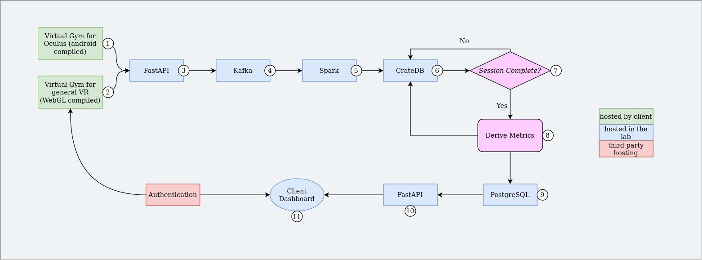

# Virtual Gym

This document outlines the pipeline for the Virtual Gym system. It contains links to code resources and explains the function of each component. This document states what is implemented, needs to be implemented, and needs to be changed.

## High Level Overview
Users play Virtual Gym on a VR headset. We have mostly worked with the Oculus Quest 2, however the system is designed to be generalizable to other headsets. The Virtual Gym app contains a collection of smaller games such as *Slice Saber* and *Balloon Party*. A **session** is what we call a playthrough of a single mini game. As a session is being played, data is being sent through a websocket to our server. The server is a PC running Ubuntu in the SSRG lab. The session data is stored and processed so that when a client goes to the dashboard (currently hosted [here](http://129.128.184.214:8099/)), they can see statistics about their progress, scores, and fitness.

## Pipeline Diagram
<figure markdown>
  
</figure>

### Virtual Gym Oculus
Oculus Quest headsets run on Android under the surface, so we compile the project to a .apk file. The app is developed in Unity Engine. Only game functionality is handled by the app. All data is immediately passed off to the server where data processing and analysis occurs.

### Virtual Gym WebGL
Virtual Reality games can be hosted by WebGL and run through the web browser on an XR device. The game itself will likely need to be hosted on our server, but this is not currently implemented.

### Python FastAPI
This API was created by editing the [SoDaTap API docker container](https://github.com/cande1gut/SoDa-TAP/tree/main/APIs). The API as of August 16th, 2022 is saved [here](https://drive.google.com/drive/folders/1yW_FcxNLCjnVCPniLgOLFU1UZbuA03mt?usp=sharing). The main.py file contains all of the existing functionality.

*In the future we will want HTTPS secure connections instead of HTTP. For a website to be HTTPS, it's API calls must also be HTTPS. That will require getting a certificate and adjusting the CORS policy.

The WebSocket is handled by the function below. Since the API is currently hosted on the IP http://129.128.184.214:8100, we use <a>ws://129.128.184.214:8100/ws</a> as the url for websocket connections. To test these endpoints, I recommend using [postman](https://www.postman.com/). This function waits for a websocket message JSON object. The object should have a "*type*" (frame, event, or session) and a "*content*" object. The content will be sent to the kafka topic of the corresponding type.

```python
@app.websocket("/ws")
async def websocket_event_endpoint(websocket: WebSocket):
    await websocket.accept()
    while True:
        raw_data = await websocket.receive_text()
        try:
            message = json.loads(raw_data)
        except:
            break
        if message.get("type") == "frame":
            topic = 'session_frame'
        elif message.get("type") == "event":
            topic = 'session_event'
        elif message.get("type") == "session":
            topic = 'session_meta'
        else:
            producer.send("session_data", str(raw_data).encode('utf-8'))
            continue
        producer.send(topic, str(message.get("content")).encode('utf-8'))
```

The main.py file also currently hosts the API endpoints for the website data. This should eventually be split into two APIs since they serve different purposes. Refer to *Step 8* for more information on those endpoints.

### Kafka (Confluent Dashboard)
The Kafka docker container on our server is taken directly from [SoDaTap](https://github.com/cande1gut/SoDa-TAP). There is no need to add topics. If the broker is setup then topics will be created as needed when called for by the API.

What is Kafka?

Think of Kafka like a warehouse. On one side of this warehouse, supplies (or data) comes in, and on the other side data comes out. The side where supplies come in has garage doors that trucks connect to and unload. Relating Kafka terminology to this warehouse, the trucks are "producers" and the garage doors are "topics". In *Step 3* we call the function `producer.send(topic, <data>)` because the API is the producer. The topic parameter is telling it what entrance of the warehouse to send that data to. Once inside the warehouse, data is stored in a queue, waiting for a "consumer" (in our case, Spark) to consume it. 
<figure markdown>
  
</figure>

### Spark
We are running Spark Jobs in python from a jupyter notebook. This docker container was also taken from [SoDaTAP](https://github.com/cande1gut/SoDa-TAP). The only changes from SoDaTAP's system are the notebooks we use. Currently we are running three notebooks to handle the three incoming topics.

- [session_event_ingest.ipynb](https://github.com/SheldonRoberts/Virtual-Gym-Documentation/blob/main/attachments/session_event_ingest.ipynb)
- [session_frame_ingest.ipynb](https://github.com/SheldonRoberts/Virtual-Gym-Documentation/blob/main/attachments/session_frame_ingest.ipynb)
- [session_meta_ingest.ipynb](https://github.com/SheldonRoberts/Virtual-Gym-Documentation/blob/main/attachments/session_meta_ingest.ipynb)

To run these notebooks, refer to the SoDaTAP GitHub documentation.

### CrateDB
CrateDB currently functions as our long term storage database for all incoming sessions, session frames and event frames. In the CrateDB dashboard you can see the tables created by Spark. This CrateDB database works as the first entry point for the session data captured by the Oculus headset. Eventually, we derive useful information from the captured sessions, and dump them in our secured PostgreSQL database hosted locally on the server. As of this time, the crateDB dashboard has a [public URL](http://129.128.184.214:4200).

### Derivation of Metrics
Based on the Session information saved directly from Oculus, meaningful metrics are calculated for each session that has been completed. Currently, we do not have the completion check step implemented, but it is a work in progress. The idea is simple, after each session is completed, we measure the metrics both **Functional Mobility** and **Game Specific** ones. If the session is not completed or interrupted or corrupted, we do not measure anything for that session.

The metrics that are implemented can be found on the Virtual Gym server under /Desktop/vgDockers/APIs/app/queries.py. If new metrics are to be incorporated, this very file can be treated as a standard. All of these metrics calculating methods are set up to be communicated through the FastAPI right now where we can pass a session id and the corresponding results are returned as a JSON object.

_Functional Mobility_ metrics are directly related to the players' movement tracking. Currently we are tracking different measurements from a player's **Head, Hand, & Eye** movement. _Game Specific_ metrics are players' performance related metrics which directly indicates how the player has done in a game session. For instance, for _Party Balloons_ game, we are measuring **Total no. of Balloons Appeared, Total no. of interaction, Successful no. of interaction**.

### POSTGRESQL DATABASE

Our more securedly maintained database is a postgres one. We only keep useful metrics information on the postgres rather than dumping what we have in CrateDB. The idea here is to make the data streaming flexible to work feasibly with CrateDB, and then only the necessary information for the client dashboard are put in POSTGRES for easy manipulation and fetching. The postgres does not have a public url, rather it is hosted locally on our virtual gym server.

We have a continuous function deployed on the virtual gym server which can calculate the different metrics for a session after it is completed only. For now, we only have game specific metrics for the _Party Balloons_ game. Th function figures out which session has been completed but does not have any metrics calculated in the PostgreSQL database. It calculates them and adds them into the PSQL database.


### FastAPI (for website data)
The same API from *Step 3* is being used to send JSON data to the dashboard website for users to visualize their data. Here is an example of an endpoint that takes in a username, start date, and end date. It returns a list of session objects.

```python
# make a get request endpoint called "/sessions" that takes a username parameter
@app.get("/sessions/{username}")
async def read_sessions(username: str, start_date: int = None, end_date: int = None):
    try:
        df = get_sessions(username)
        if start_date and end_date:
            # convert int to datetime
            start_date = datetime.datetime.fromtimestamp(start_date)
            end_date = datetime.datetime.fromtimestamp(end_date)
            df = df[(df['Date'] >= start_date) & (df['Date'] <= end_date)]
        return df.to_json(orient='records')
    except Exception as e:
        return {"error": str(e)}
```

And here is an example of the JSON that gets returned. [http://129.128.184.214:8100/sessions/SheldonR](http://129.128.184.214:8100/sessions/SheldonR):
```json
{
    "Date":1660081446000,
    "DeviceId":"348db0e8d42742b0b14ec24f15113447afa84b58",
    "Game":"Bubbles-UnderSea",
    "Platform":"Quest",
    "SessionId":"2022-08-09T21.44.06SheldonR348db0e8d42742b0b14ec24f15113447afa84b58",
    "UserName":"SheldonR",
    "Version":"3.1"
}
```

To add new feature with data from database, one needs to-

1. Make an API endpoint to request data
2. Fetch that data in the Client Dashboard project.
3. Visualize the fetched data

### Client Dashboard
Previously, we were hosting the dashboard on our own server. It would be nice to host it on the free Firebase plan, but that requires all of our API calls to be HTTPS. We need to add SSL certification to the server before hosting on Firebase. As of August 17, 2022 the website is hosted [here](http://129.128.184.214:8099/). The plan for the client dashboard was a website for users of Virtual Gym to make an account and view their information / statistics. The front end was made with React and Typescript. The user authentication was handled by Firebase. The plan was to have new users sign up on the website. When they open the Virtual Gym app, they are prompted to sign in. We used the Firebase API to confirm a user exists in our system and has the necessary authorization to play. After their session, they can go back to the website to see in-depth analysis.

***For now, we are switching our front-end to align with the front-end from VIBRANT MIND.***

### Firebase Authentication
All of our user authentication data is stored on Firebase. The Firebase dashboard allows you to view, edit, and remove user profiles. Firebase has APIs for web, mobile, Unity, etc. The API can handle registration, login, password reset, and pretty much anything else we will require for user auth. 
